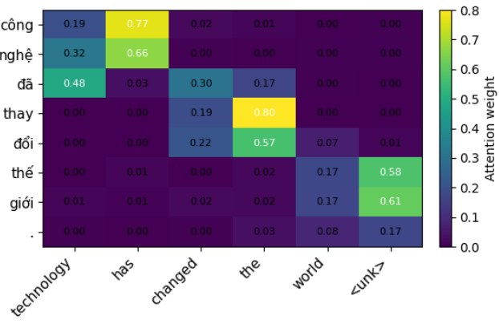

# Machine Translation

Transformer model built **from scratch** with PyTorch 
Trained on the [IWSLT'15 English-Vietnamese](https://www.kaggle.com/datasets/tuannguyenvananh/iwslt15-englishvietnamese) dataset.

## Results

|| BLEU |
|-------|------|
| Val (tst2012) | *25.20* |
| Test (tst2013) | *27.29* |

## Architecture

- Encoder-Decoder Transformer (4 layers, 8 heads, d_model=256, d_ff=1024)
- Multi-Head Attention, Positional Encoding, Layer Normalization
- Beam Search decoding
- Label Smoothing

## Training Loss


## Attention Heatmaps
**Input:** Technology has changed the world significantly.

**Output:** công nghệ đã thay đổi thế giới .



## Project Structure

```
├── config.py       
├── vocabulary.py    
├── dataset.py       
├── model.py         
├── utils.py        
├── train.py         
├── evaluate.py      
```

## Setup


Update `DATA_DIR` in `config.py` to point to your local dataset path.

## Training

```bash
python train.py
```

## Evaluation

```python
from evaluate import run_evaluation
run_evaluation(model, val_ds, test_ds, trg_vocab)
```
